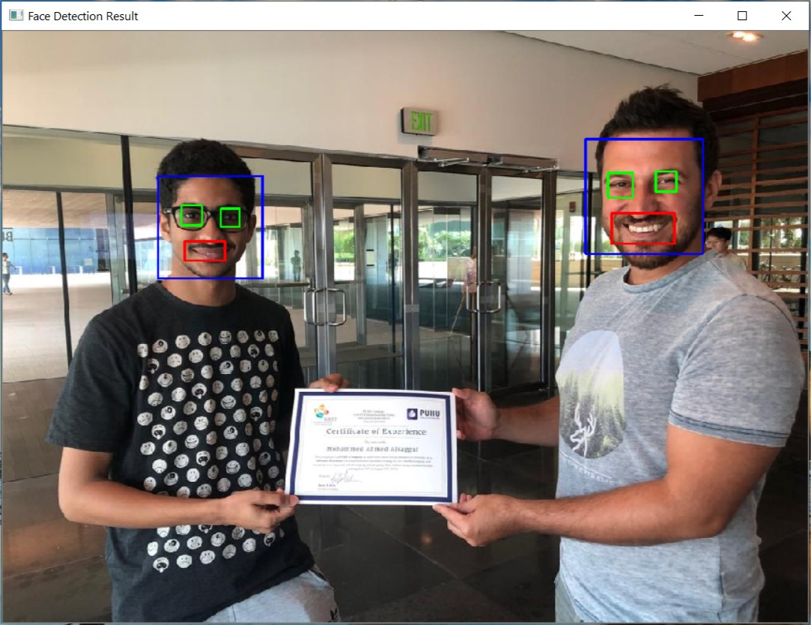

# Face-Detection-Using-Python-and-OpenCV

#### This project is about detecting faces, eyes, and smiles for stationary pictures using Python and OpenCV.

## Firslty, the OpenCV library was isntalled following the tutorial [1] then using the command
###  pip install opencv-python
  
  
  
  
## Then, the code was written in Python after importing cv2 from the OpenCV library

 ### Casecade classifers for face, smile and eyes were used from the openCV github page [2].
 
 
 
 
## Finally, the resultant picture is shown in a window 

